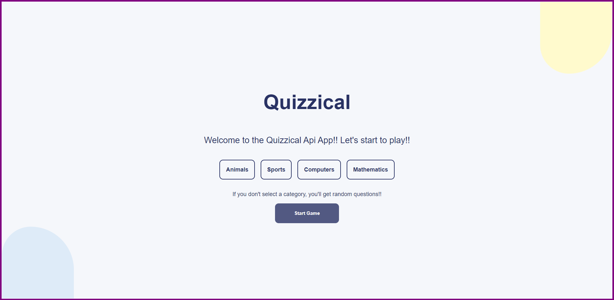
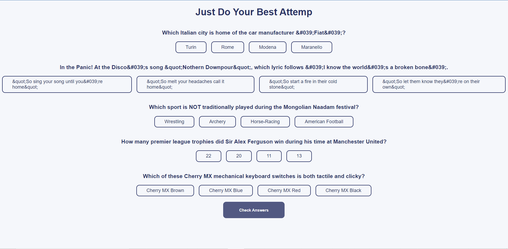
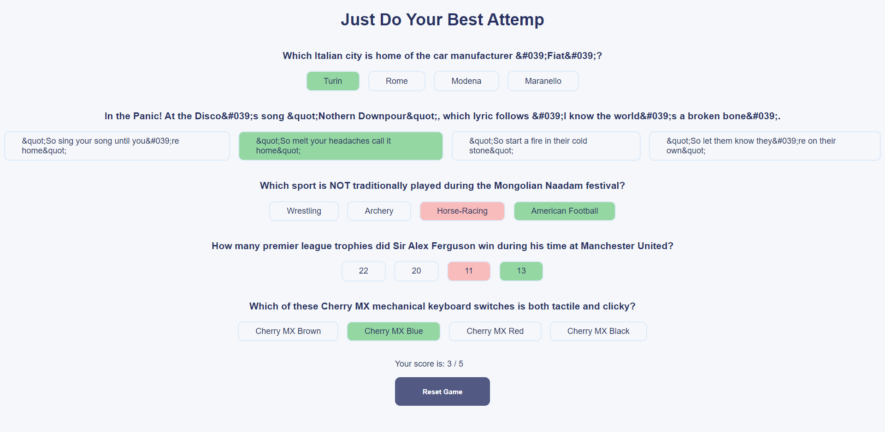

# QUIZZICAL APP

This project was built using react js. I'm junior web developer looking for improve my skills to get a nice job.I hope you enjoy my project!!

* Live: <a href="https://jhonaquejadau.github.io/quizzical-app/">jhonaquejadau.github.io/quizzical-app</a>

# Screenshots

Let's take a overview about the project and it's features.

### `Home Page`

**Version v1.0.0**

### `Game Page`

**Version v1.0.0**

# Versions

**v1.0.1**
* Gh-Pages configuration.

**v1.0.0**
* Home page with category selector.
* Question page with check options.

# Libraries, Frameworks, Technologies

1. Html
2. Css
3. JavaScript
4. [React Js](https://es.reactjs.org/)
5. [npm js](https://www.npmjs.com/)

# Credits 
Thanks to [OPENTDB](https://opentdb.com/) for creating an awesome trivia API for developers. I appreciate your team's hard work in providing the data needed to take my coding skills to the next level.

# Copyright Note
This is a personal project, is non-commercial. This, is just for improve my web development skills using React Js, Tailwind Js, and fetching API's. Feel free to enjoying my personal websites and look for your favorite movie.